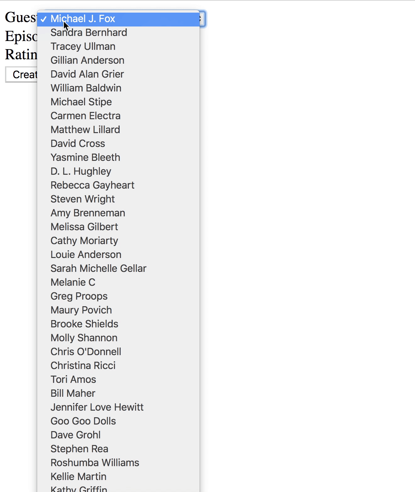

# Rails Assessment

It's time to put our Rails know-how to the test. Today, we have a basic new application.

## Objectives
+ MVC
+ REST
+ Request/Response Cycle
+ Form/Form Helpers
+ ActiveRecord
+ Validations

## Setup

Before you begin, fork and clone this repo, run `rake db:migrate` and `rake db:seed` to get started.

## The Domain

You've just been hired by 'The Late Show With Stephen Colbert' - congratulations! The production staff needs help keeping track of all of the guests that they've had on the show. To do this, we need to be able to keep track of each guest and all of their appearances on the show.

Luckily, another developer has already started the job. We have a model for guests and a model for episodes. Visiting `'/guests'` displays all of the guests, and visiting `'/episodes'` displays all of the episodes. We just don't have a way to associate an episode with a guest. Remember that guests can appear on the show many times, and an episode can (and usually does) have many guests.

## Instructions / Deliverables
1. To log that a specific guest appeared on a certain episode, we'll need to store some additional data. Make the necessary updates to the schema so that **a guest can appear on many episodes**, as well as **an episode can have multiple guests**.  The appearance should also have a way to **store the guest's rating for that episode in the range of 1 to 5**.

2. As a user, I should be able to fill out a form to **create a new appearance**. I should be able to **choose an existing guest, an existing episode, and add a rating**. Upon successfully creating an appearance, I should be **redirected to the selected episode's show page**.

3. On the guests index page, clicking on a guest's name should take us to a **detail view about each guest**. This View should **include the guest's name and occupation**.

4. As a user, I should be able to **view all of the guests for a particular episode**. This means that we'll need an episode's show page that lists out all of the guests who were on that episode.

### Hints / Tips

+ Remember we want to be RESTful. What URL should show info about a particular guest? What URL should show a form to create an appearance? What controller actions are associated?  
+ There are probably many ways to set this up.

View <a href='https://learn.co/lessons/immersive-rails-assessment'>Immersive Rails Assessment</a> on Learn.co and start learning to code for free.

